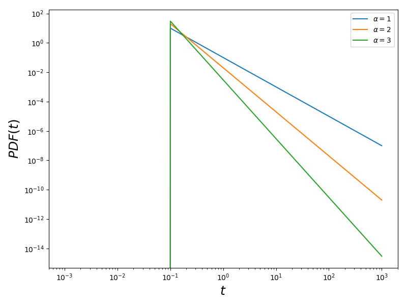
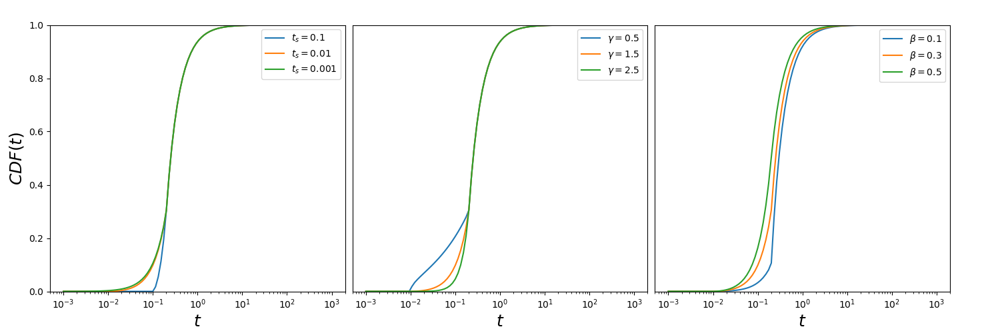
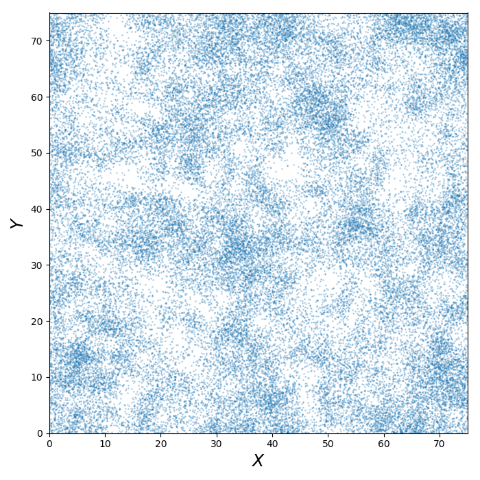

===========
Lévy Flight
===========

Tutorial
========

Random walk distributions draw step sizes randomly from a given probability
distribution function. The walk begins at a point and 'steps' to a new point in a random
direction.

These types of distributions were invented by Benoît Mandelbrot. The Lévy flight
distribution is a specific random walk distribution useful for creating fractal
distribution which exhibits power law clustering.

2D vs 3D
--------

In these example we will look only at Lévy flight distribution, first in 2D
and then 3D. All other parameters are kept to their default values. We will
explore what the other parameters do later.

2D
^^

In this example we show how to generate a random walk distribution in 2D. Since
the default setting is in 3D we will need to specify that we want this in 2D.

Before this we need to first import some basic modules for plotting and MiSTree itself.

.. code-block:: python

    import numpy as np
    import matplotlib.pylab as plt
    import mistree as mist

To generate a 2D Lévy flight sample, we will need to first specify how many points
we want in our random walk. This is given below by a parameter we call ``size``.
Be careful with the size, if you make this too large, because of the periodic
boundary conditions, this will result in a distribution that is no different to a
random distribution!

.. code-block:: python

    size = 50000
    x, y = mist.get_levy_flight(size, mode='2D')

This will give you a clustered distribution which looks like this:

.. code-block:: python

    plt.figure(figsize=(6., 6.))
    plt.plot(x, y, 'o', markersize=1., alpha=0.1)
    plt.xlabel(r'$X$')
    plt.ylabel(r'$Y$')
    plt.xlim(0., 75.)
    plt.ylim(0., 75.)
    plt.tight_layout()
    plt.show()

.. image:: img/2D_example.png
    :scale: 75 %
    :align: center

3D
^^

Creating a 3D distribution is even easier, since this is the default setting for
all the random walk functions. Like before we again specify the ``size`` and generate
the distribution in the following way:

.. code-block:: python

    size = 50000
    x, y, z = mist.get_levy_flight(size)

We plot the 3 dimensions across 3 plains: X vs Y, X vs Z and Z vs Y:

.. code-block:: python

    import matplotlib.gridspec as gridspec

    plt.figure(figsize=(10., 10.))
    gs = gridspec.GridSpec(2, 2, hspace=0.05, wspace=0.05)
    gs.update(left=0.075, right=0.975, top=0.975, bottom=0.075)
    ax1 = plt.subplot(gs[2])
    ax2 = plt.subplot(gs[3])
    ax3 = plt.subplot(gs[0])
    ax1.plot(x, y, 'o', markersize=1, alpha=0.1)
    ax2.plot(z, y, 'o', markersize=1, alpha=0.1)
    ax3.plot(x, z, 'o', markersize=1, alpha=0.1)
    ax1.set_xlabel(r'$X$', fontsize=18)
    ax1.set_ylabel(r'$Y$', fontsize=18)
    ax2.set_xlabel(r'$Z$', fontsize=18)
    ax3.set_ylabel(r'$Z$', fontsize=18)
    ax2.set_yticks([])
    ax3.set_xticks([])
    ax1.set_xlim(0., 75.)
    ax1.set_ylim(0., 75.)
    ax2.set_xlim(0., 75.)
    ax2.set_ylim(0., 75.)
    ax3.set_xlim(0., 75.)
    ax3.set_ylim(0., 75.)
    plt.show()

.. image:: img/3D_example.png
    :scale: 60 %
    :align: center

Periodic boundary
-----------------

All random walk distributions created by MiSTree have periodic boundary conditions
by default. This means that the box is repeated infinitely in all dimensions. This
is a common procedure used in N-Body simulations. When a particle steps out of the
boundary it actually re-enters the box from the other side. The size of the box can
be specified by setting the ``box_size`` in any of the Lévy flight functions.

.. code-block:: python

    size = 1000

    # default box_size=75.
    x, y, z = mist.get_levy_flight(size, box_size=75.)

    # changing the box_size=100.
    x, y, z = mist.get_levy_flight(size, box_size=100.)

However, if you want
to turn this off you will need to set ``periodic=False``.

.. code-block:: python

    size = 1000
    x, y = mist.get_levy_flight(size, mode='2D', periodic=False)

Which we plot as:

.. code-block:: python

    plt.figure(figsize=(6., 6.))
    plt.plot(x, y, 'o', markersize=1., alpha=0.5)
    plt.xlabel(r'$X$')
    plt.ylabel(r'$Y$')
    plt.tight_layout()
    plt.show()

.. image:: img/2D_example_no_periodic_boundary.png
    :scale: 75 %
    :align: center

Random Walk Models
------------------

Random walk distributions can be made by one of the Lévy flight functions:
``get_levy_flight`` or ``get_adjusted_levy_flight`` which creates a distribution
of *Lévy flight* and *adjusted Lévy flight* distributions, respectively. Both of
these functions interact with the function ``get_random_flight`` which can be used
to generate a random walk with your own specified probability distribution function
(PDF). Below we will explain in detail how these distributions work and what the
parameters do in each model.

Lévy Flight
^^^^^^^^^^^

Lévy flights are defined with a power law PDF and a cumulative distribution
function (CDF) given by,

.. math::
    :nowrap:

    \begin{equation*}
    CDF(t) = \left\{ \begin{array}{lcl}
    0  & \mbox{for} & t < t_{0} \\
    1 - \left(\frac{t}{t_{0}}\right)^{-\alpha} & \mbox{for} & t\geq t_{0}
    \end{array} \right.
    \end{equation*}

Where:

    * :math:`t` -- step sizes
    * :math:`t_{0}` -- minimum step size.
    * :math:`\alpha` -- defines the slope of power law.

The PDF for the Lévy flight is given by,

.. math::
    :nowrap:

    \begin{equation*}
    PDF(t) = \left\{ \begin{array}{lcl}
    0  & \mbox{for} & t < t_{0} \\
    \alpha \frac{t_{0}^{\alpha}}{t^{1+\alpha}} & \mbox{for} & t\geq t_{0}
    \end{array} \right.
    \end{equation*}

If we are to change :math:`t_{0}`, which is the minimum step length, to shorter
values this results in there being a higher probability of smaller step sizes.

.. image:: img/levy_flight_changing_t0.png
    :scale: 60 %
    :align: center

We now generate a set of realisations with these parameters.

.. code-block:: python

    size = 50000 # how many particles in the distribution

    x1, y1 = mist.get_levy_flight(size, t_0=0.01, alpha=1.5, mode='2D')
    x2, y2 = mist.get_levy_flight(size, t_0=0.1, alpha=1.5, mode='2D')
    x3, y3 = mist.get_levy_flight(size, t_0=1., alpha=1.5, mode='2D')

which are plotted:

.. code-block:: python

    plt.figure(figsize=(15., 5.))
    gs = gridspec.GridSpec(1, 3, hspace=0.025)
    gs.update(left=0.05, right=0.95, top=0.925, bottom=0.125)
    ax1 = plt.subplot(gs[0])
    ax2 = plt.subplot(gs[1])
    ax3 = plt.subplot(gs[2])
    ax1.plot(x1, y1, 'o', markersize=1, alpha=0.1)
    ax2.plot(x2, y2, 'o', markersize=1, alpha=0.1)
    ax3.plot(x3, y3, 'o', markersize=1, alpha=0.1)
    ax1.set_xlabel(r'$X$', fontsize=18)
    ax1.set_ylabel(r'$Y$', fontsize=18)
    ax2.set_xlabel(r'$X$', fontsize=18)
    ax3.set_xlabel(r'$X$', fontsize=18)
    ax2.set_yticks([])
    ax3.set_yticks([])
    ax1.set_xlim(0., 75.)
    ax1.set_ylim(0., 75.)
    ax2.set_xlim(0., 75.)
    ax2.set_ylim(0., 75.)
    ax3.set_xlim(0., 75.)
    ax3.set_ylim(0., 75.)
    ax1.set_title(r'$t_{0}=0.01$')
    ax2.set_title(r'$t_{0}=0.1$')
    ax3.set_title(r'$t_{0}=1.$')
    plt.show()

.. image:: img/levy_flight_changing_t0_distribution.png
    :scale: 50 %
    :align: center

If we instead vary :math:`\alpha` this changes the gradient of the slope.

We now generate a set of realisations with these parameters.

.. code-block:: python

    size = 50000 # how many particles in the distribution

    x1, y1 = mist.get_levy_flight(size, t_0=0.1, alpha=1., mode='2D')
    x2, y2 = mist.get_levy_flight(size, t_0=0.1, alpha=1.5, mode='2D')
    x3, y3 = mist.get_levy_flight(size, t_0=0.1, alpha=2., mode='2D')

Which we then plot:

.. code-block:: python

    plt.figure(figsize=(15., 5.))
    gs = gridspec.GridSpec(1, 3, hspace=0.025)
    gs.update(left=0.05, right=0.95, top=0.925, bottom=0.125)
    ax1 = plt.subplot(gs[0])
    ax2 = plt.subplot(gs[1])
    ax3 = plt.subplot(gs[2])
    ax1.plot(x1, y1, 'o', markersize=1, alpha=0.1)
    ax2.plot(x2, y2, 'o', markersize=1, alpha=0.1)
    ax3.plot(x3, y3, 'o', markersize=1, alpha=0.1)
    ax1.set_xlabel(r'$X$', fontsize=18)
    ax1.set_ylabel(r'$Y$', fontsize=18)
    ax2.set_xlabel(r'$X$', fontsize=18)
    ax3.set_xlabel(r'$X$', fontsize=18)
    ax2.set_yticks([])
    ax3.set_yticks([])
    ax1.set_xlim(0., 75.)
    ax1.set_ylim(0., 75.)
    ax2.set_xlim(0., 75.)
    ax2.set_ylim(0., 75.)
    ax3.set_xlim(0., 75.)
    ax3.set_ylim(0., 75.)
    ax1.set_title(r'$\alpha=1$')
    ax2.set_title(r'$\alpha=1.5$')
    ax3.set_title(r'$\alpha=2$')
    plt.show()

.. image:: img/levy_flight_changing_alpha_distribution.png
    :scale: 50 %
    :align: center

These two parameters can both be changed to affect the amount of clustering. But since
:math:`\alpha` is directly related to the two point correlation function it is often
considered to be the more important parameter.

Adjusted Lévy Flight
^^^^^^^^^^^^^^^^^^^^

We developed a move flexible Lévy flight model to better deal with small scales.
Normal Lévy flight distributions are able to produce power law 2PCF, however below
:math:`t_{0}` the 2PCF plateaus. To be able to control what happens below this scale
we instead use a Lévy flight model which has a CDF:

.. math::
    :nowrap:

    \begin{equation*}
    CDF(t) = \left\{ \begin{array}{lcl}
    0  & \mbox{for} & t < t_{s} \\
    \beta\left(\frac{t-t_{s}}{t_{0}-t_{s}}\right)^{\gamma}& \mbox{for} & t_{s} \leq t < t_{0}\\
    (1-\beta)\left[1 - \left(\frac{t}{t_{0}}\right)^{-\alpha}\right]+\beta & \mbox{for} & t\geq t_{0}
    \end{array} \right.
    \end{equation*}

which we call the *adjusted Levy flight*, where :math:`t_{0}` and :math:`\alpha`
play the same role as they do in the normal Lévy flight distribution. The CDF
is built of two CDFs: (1) the normal Lévy flight part which operates for step sizes
larger than :math:`t_{0}` and (2) the adjusted part operates between step sizes
:math:`t_{s}` and :math:`t_{0}` where :math:`t_{s} < t_{0}`. Unlike the normal
Lévy flight distribution, which transitions from a :math:`PDF(t<t_{0}) = 0` to a
peak at :math:`PDF(t_{0})` the adjusted Lévy flight had a gradual rise in between
:math:`t_{s}` and :math:`t_{0}`. The other parameters have the following roles:

    * :math:`t_{s}` -- the minimum step sizes.
    * :math:`\beta` -- the fraction of steps between :math:`t_{s}` and :math:`t_{0}`.
    * :math:`\gamma` -- defines the gradient of the rise.

The PDF is thus defined as:

.. math::
    :nowrap:

    \begin{equation*}
    CDF(t) = \left\{ \begin{array}{lcl}
    0  & \mbox{for} & t < t_{s} \\
    \frac{\beta\gamma t}{(t-t_{s})}\left(\frac{t-t_{s}}{t_{0}-t_{s}}\right)^{\gamma}& \mbox{for} & t_{s} < t < t_{0}\\
    \frac{\alpha(1-\beta)}{t_{0}}t^{-(1+\alpha)} & \mbox{for} & t\geq t_{0}
    \end{array} \right.
    \end{equation*}

Below we show what happens to the CDF of the adjusted Lévy flight distribution if we
vary these parameters individually whilst keeping all other parameters constant.

Other Random Walk
^^^^^^^^^^^^^^^^^

To create a flight distribution with a user defined step size distribution. You will
need to first generate a distribution of step sizes. To do this you will need to
invert the CDF of the distribution. Once you have a distribution of step sizes
you can pass this to the ``get_random_flight`` function.

We will step you through how to do this using a step size distribution which follows
a log normal distribution.

.. math::

    CDF(t) = \frac{1}{2} + \frac{1}{2} {\rm erf} \left[\frac{\ln t -\mu}{\sqrt{2}\sigma}\right]

To generate a random log normal distribution we invert this function giving us:

.. math::

    t = \exp \left[\sqrt{2}\sigma\ {\rm erf}^{-1}(2u-1) + \mu\right]

Where :math:`CDF(t)=u`. Here, ``u`` is a randomly drawn number between 0 and 1.
We can generate this in the following way:

.. code-block:: python

    import numpy as np
    import matplotlib.pylab as plt
    from scipy.special import erfinv
    import mistree as mist

    size = 50000
    u = np.random.random_sample(size)

    mu = 0.1
    sigma = 0.05
    steps = np.exp(np.sqrt(2.)*sigma*erfinv(2.*u-1.)+mu)

    x, y = mist.get_random_flight(steps, mode='2D', box_size=75., periodic=True)

    plt.figure(figsize=(7., 7.))
    plt.plot(x, y, 'o', markersize=1., alpha=0.25)
    plt.xlabel(r'$X$', fontsize=18)
    plt.ylabel(r'$Y$', fontsize=18)
    plt.xlim(0., 75.)
    plt.ylim(0., 75.)
    plt.tight_layout()
    plt.show()

Functions
=========

Indepth documentation on the functions to generate Lévy Flight-like simulations are provided below.

.. function:: get_random_flight(steps [, mode='3D', box_size=75., periodic=True])

    Generates a random realisation of a 'Levy flight'-like distribution. The random step step sizes
    are defined by the user.

    :param steps: Distribution of step sizes defines by the user.
    :type steps: array
    :param mode: '2D' or '3D' -- Defines whether the distribution is defined in 2D or 3D cartesian coordinates.
    :type mode: str
    :param box_size: Length of the periodic box across one axis.
    :type box_size: float
    :param periodic: If ``True`` then this sets periodic boundary condition on the Lévy flight realisation. If ``False``, the box_size parameter is ignored.
    :type periodic: bool

    :returns: **x**, **y**, **z** *(array)* -- Distribution of random walk particles. **z** is only outputted if this is a 3D distribution.

.. function:: get_levy_flight(size[, periodic=True, box_size=75., t_0=0.2, alpha=1.5, mode='3D'])

    Generates a random realisation of a Levy flight distribution.

    :param size: Number of points.
    :type size: int
    :param mode: '2D' or '3D' -- Defines whether the distribution is defined in 2D or 3D cartesian coordinates.
    :type mode: str
    :param box_size: Length of the periodic box across one axis.
    :type box_size: float
    :param periodic: If ``True`` then this sets periodic boundary condition on the Lévy flight realisation. If ``False``, the box_size parameter is ignored.
    :type periodic: bool
    :param t_0: Levy flight parameter, minimum step size.
    :type t_0: float
    :param alpha: Levy flight parameter, step size power law slope.
    :type alpha: float

    :returns: **x**, **y**, **z** (*array*) -- Distribution of Levy flight particles. **z** is only outputted if this is a 3D distribution.

.. function:: get_adjusted_levy_flight(size[, mode='3D', periodic=True, box_size=75., t_0=0.325, t_s=0.015, alpha=1.5, beta=0.45, gamma=1.3])

    Generates a random realisation of an adjusted Levy flight (ALF) distribution.

    :param size: Number of points.
    :type size: int
    :param mode: '2D' or '3D' -- Defines whether the distribution is defined in 2D or 3D cartesian coordinates.
    :type mode: str
    :param box_size: Length of the periodic box across one axis.
    :type box_size: float
    :param periodic: If ``True`` then this sets periodic boundary condition on the Lévy flight realisation. If ``False``, the box_size parameter is ignored.
    :type periodic: bool
    :param t_0: ALF parameter, minimum step size for Levy flight component.
    :type t_0: float
    :param alpha: ALF parameter, step size power law slope.
    :type alpha: float
    :param t_s: ALF parameter, minimum step size for adjusted component.
    :type t_s: float
    :param beta: ALF parameter, fraction of steps below ``t_0``.
    :type beta: float
    :param gamma: ALF parameter, the gradient for the slow rise of the ALF's cumulative distribution function.
    :type gamma: float

    :returns: **x**, **y**, **z** (*array*) -- Distribution of adjusted Levy flight particles. **z** is only outputted if this is a 3D distribution.
